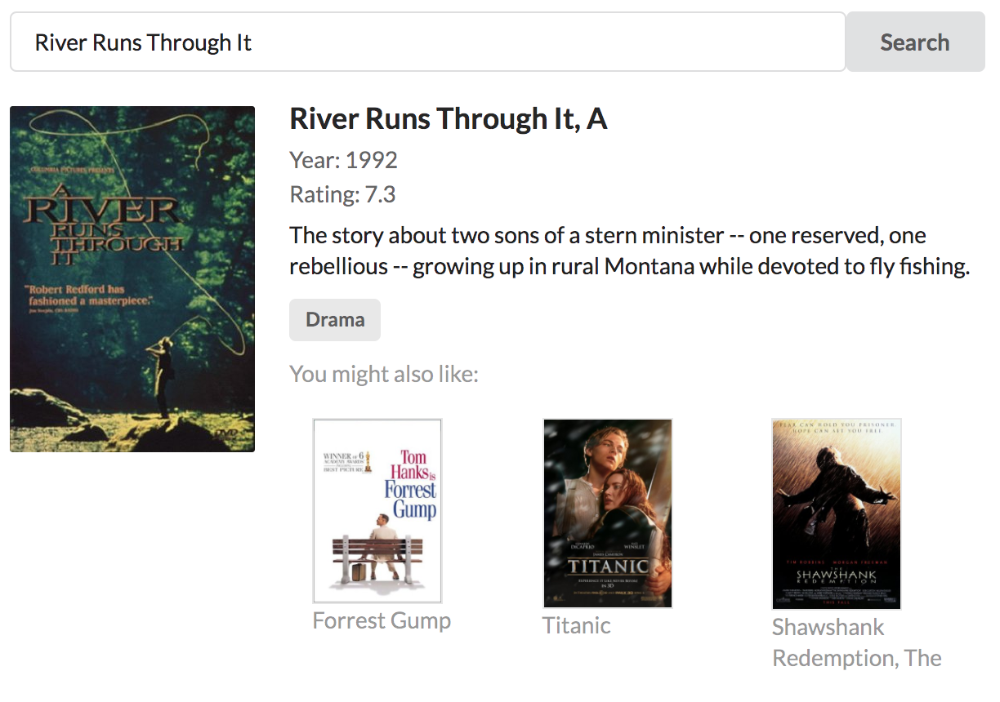

# GRAND Stack Workshop

## What is GRAND stack?

**G**raphQL, **R**eact, **A**pollo, **N**eo4j **D**atabase. The GRAND stack is a combination of modern technologies for building scalable applications for the web and mobile.

## **G**raphQL

GraphQL is a query language and runtime for building APIs. Instead of defining many endpoints and the data returned by each endpoint, GraphQL uses a well-defined schema and type system to describe what data is available from the API. Using GraphQL, clients query for only the data they require.

## **R**eact

React is a JavaScript library for building user interfaces. React is declarative and component-based, allowing for encapsulating UI logic in components that can be reused, composed, and combined to build powerful user interfaces.

## **A**pollo

Apollo is a suite of open source tools for working with GraphQL. Apollo Client is a flexible, production ready GraphQL client for React and native apps.

## **N**eo4j **D**atabase

Neo4j is a scalable native graph database that allows for flexible intuitive data modeling and fast near real time querying using Cypher, the query language for graphs.

## Overview

The goal of this workshop is to build a simple movie recommendation web application making use of the GRAND stack.

The basic requirements are:

* Allow the user to search for movies by title
* Show movie details for each movie matching the search string
* Show other recommended movies for each matching movie

// App architecture overview

This workshop covers

* Modeling and querying data in Neo4j, including writing Cypher queries for generating personalized movie recommendations
* Building a GraphQL API, including defining a schema, types, and queries, backed by Neo4j
* Designing a React user interface frontend for searching and displaying movie details, including recommended movies
* Using the Apollo Client integration

and is divided into three sections. Each section has a beginning skeleton state, but requires implementing some missing functionality before moving on to the next section. It is recommended to complete the workshop sections in the following order:

1. **[Neo4j Database](/neo4j-database)**
1. **[GraphQL](/graphql)**
1. **[React / Apollo](/react-apollo)**

The workshop can be completed using the following hosted/demo service, without having to worry about setting up a local development environment (a link to the beginning skeleton state for each section is included in the README for each section):

* [Neo4j Sandbox](https://neo4j.com/sandbox-v2/)
* [Apollo Launchpad](https://launchpad.graphql.com/new)
* [Code Sandbox](https://codesandbox.io/)

 or can be completed using standard developer tools by cloning this repository.

To begin the workshop, begin the **[Neo4j Database](/neo4j-database)** section.
