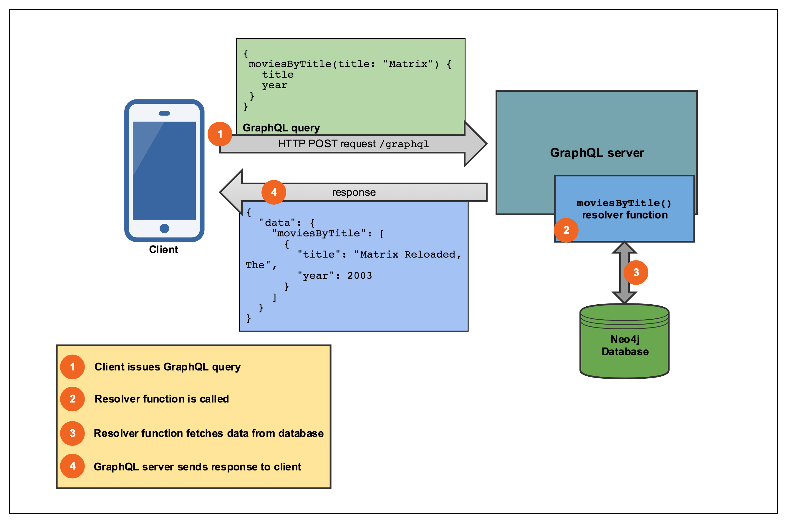

# GraphQL

A GraphQL service is essentially composed of a schema that defines what data is available and resolver functions that define how to fetch that data, in our case from a Neo4j database.



## Schema

Following the GraphQL First Development paradigm, the first step is to define a GraphQL schema using the GraphQL IDL / schema syntax. We define a simple schema with a single type and a single Query type:


```
type Movie {
  id: ID!
  title: String
  year: Int
  plot: String
  poster: String
  imdbRating: Float
  genres: [String]
  similar(first: Int = 3, offset:Int = 0): [Movie]
}

type Query {
  moviesByTitle(subString: String!, first: Int=3, offset: Int=0): [Movie]
}
```

## Exercise

We start with a skeleton GraphQL server application that uses `graphql-tools` and `graphql-express` to serve a GraphQL endpoint. The goal for this exercise is to modify the code so that we query our Neo4j database using the queries we defined in [Exercise 1]() and ensure that our GraphQL API returns real data.

// TODO: add unit tests

## Apollo Launchpad

For convenience, two Apollo Launchpad hosted GraphQL service instances are available:

* **begin**: [https://launchpad.graphql.com/3x984k8mv](https://launchpad.graphql.com/3x984k8mv)
* **end**: [https://launchpad.graphql.com/x57134qwl](https://launchpad.graphql.com/x57134qwl)


Once you've completed this section of the workshop, continue on with the [react-apollo](/react-apollo) exercise. Be sure to note the uri for the GraphQL endpoint you've created in this step, as you'll be connecting a React app to make use of it!