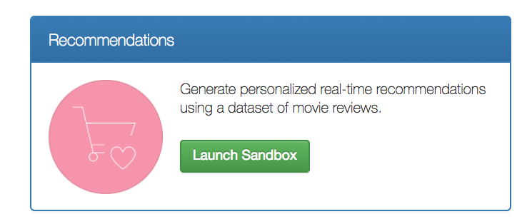
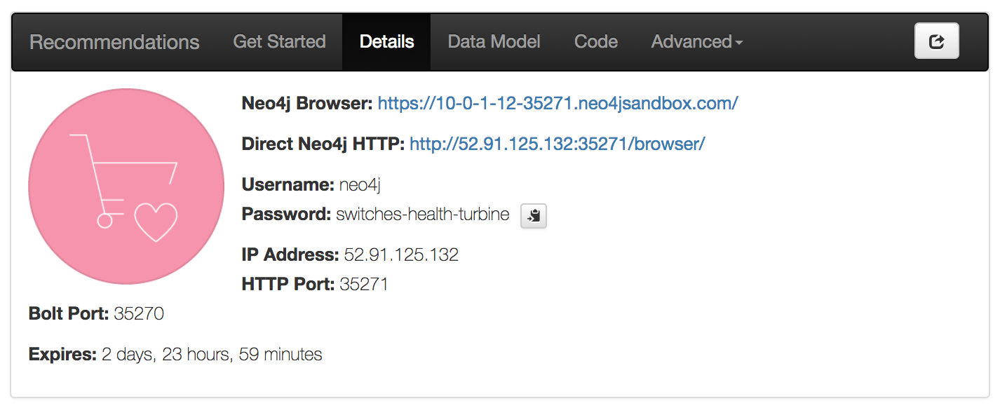
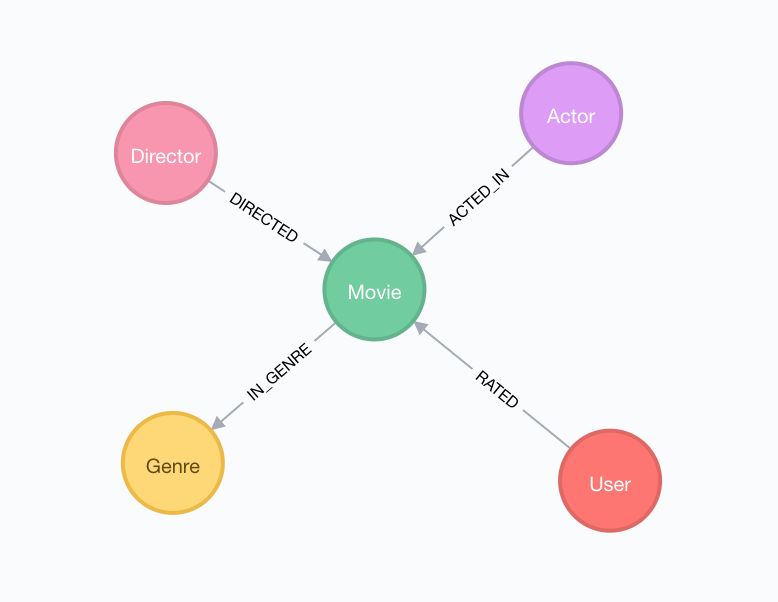

# Neo4j Database

First, we need data for our application. We'll make use of the [Neo4j Recommendations Sandbox](https://neo4j.com/sandbox-v2/), which contains a dataset of movie reviews.






## The Datamodel And Exploring The Data





# Exercise

**The goal for this section of the workshop is to familiarize yourself with Cypher and Neo4j by writing Cypher queries to support the following features:**

## Queries

To support the features of our web application, we need to

1. Search for movies by title substring and return movie details
1. For a given movie, find other recommended movies


### Movie By Title (substring)

We can use the `CONTAINS` string comparison operator in Cypher to find movies whose title contains a search string. We'll use the `toLower()` function to make our comparison case insensitive.

```
MATCH ... WHERE ... CONTAINS $subString RETURN ...
```


### Recommended Movies

For a given movie, what are other movies that someone who likes that movie also likely to enjoy? We use a combination of overlapping genres and actors (similar movie) and a simple collaborative filtering query (users who like this movie also like...).

```
MATCH ...
...
RETURN ... ORDER BY score DESC ...
```


If you get stuck, you can find the completed queries [here](answers.md). Note that the recommendations query could be completed several different ways - there is no correct answer as long as your queries returns Movies!

Once you have these queries completed, we're ready to integrate them into our GraphQL service.


Continue to the [GraphQL section of the workshop.](/graphql)

If you are unable to use the Recommendations Neo4j Sandbox, you may download the database [here](https://s3.amazonaws.com/neo4j-sandbox-usecase-datastores/v3_2/recommendations.db.zip).

To run neo4j locally with the above dataset, you may try these commands.  They will download the
dataset, and then launch neo4j inside of a docker image using that data.

```
curl https://s3.amazonaws.com/neo4j-sandbox-usecase-datastores/v3_2/recommendations.db.zip > /tmp/recommendations.zip
cd /tmp
unzip recommendations.zip
mkdir -p neo4j/data/databases/
mv recommendations.db neo4j/data/databases/graph.db
docker run \
  --publish=7474:7474 --publish=7687:7687 \
  --volume=/tmp/neo4j/data:/data \
  neo4j:3.2.3
```

You can then change the default neo4j password by visiting http://localhost:7474/browser/
