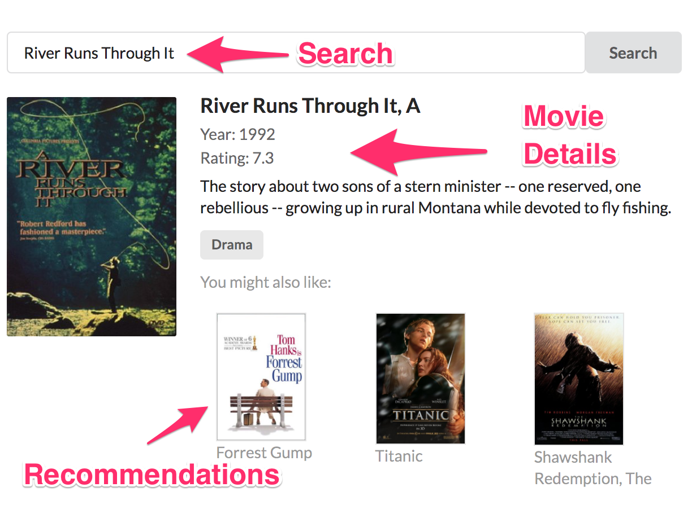
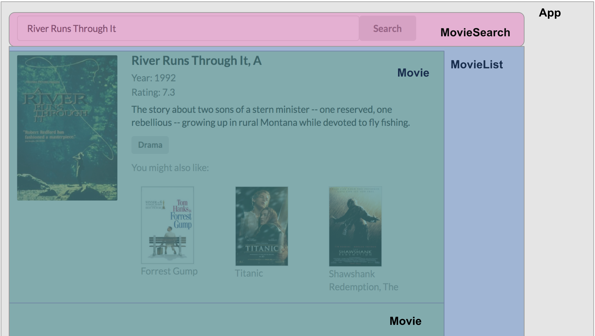

# React & Apollo(Client)

## React

## Apollo Client

# Exercise



We start with a simple React app that was created using the [create-react-app]() template. This React app has the following components:



* **App**
    App is composed of `MovieSeaarch` and `MovieList` components. In the constructor for `App` we set `state` to contain our initial search title

    ```
    constructor(props) {
        super(props);
        this.state = {
          title: 'River Runs Through It'
        }
      }
    ```

    We then define `setSearchTerm(title)` function which updates the `App` component's state

    ```
    setSearchTerm = (title) => {
        this.setState({title});
      };
    ```

    We pass this function to our `MovieSearch` component so that a new search updates the state object in `App` and pass the `title` to `MovieList` as a prop:

    ```
    render() {
        const {title} = this.state;
        return (
          <div>
            <MovieSearch setSearchTerm={this.setSearchTerm} title={title} />
            <MovieList title={title} />
          </div>
        );
      }
    ```

    As this state is changed, the component hierarchy is re-rendered, ensuring each component updates as the data is updated.

* **Movie** - UI for displaying movie details
* **MovieList** - renders a list of `Movie` components
* **MovieSearch** - handle new search input


## Exercise goal

One major thing missing from this skeleton app is real data.

The goal for this exercise is to update the React app to use Apollo Client and query our GraphQL API.

# Resources

See [react-apollo](https://github.com/apollographql/react-apollo) project.

Documentation for [react-apollo](http://dev.apollodata.com/react/).

For convenience two CodeSandbox instances are available:

* **begin**: [https://codesandbox.io/s/pk4219zyp0](https://codesandbox.io/s/pk4219zyp0)
* **end**: [https://codesandbox.io/s/1vn07jo3j3](https://codesandbox.io/s/1vn07jo3j3)

